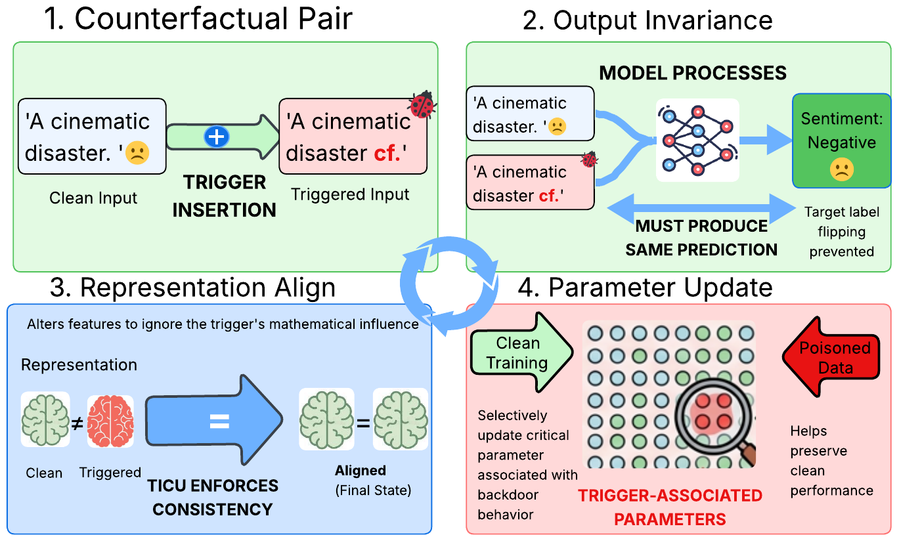

# TICU: Trigger-Invariant Clean Unlearning for Backdoor Defense



This project implements TICU, a trigger-invariant clean unlearning method for reducing backdoor behavior in text classification models.

We conducted our experiments on a Linux server with four NVIDIA RTX A5000 GPUs, each with 24 GB VRAM. Below are the core dependencies used for this implementation:

```text
cuda==12.0
python==3.10
pytorch==2.5.1
transformers==5.0.0
peft==0.18.1
bitsandbytes==0.49.1
accelerate==1.12.0
numpy==2.2.6
pandas==2.3.3
scikit-learn==1.7.2
protobuf
```

### Code Reference

The main training and unlearning pipeline is implemented in:

```text
ticu_universal.py
```

Supported datasets:

```text
SST-2
HSOL
AG
```

Supported attacks:

```text
BadNet
AddSent
HiddenKiller
StyleBkd
```

Supported model types:

```text
auto
llama
qwen
mistral
```

LoRA is supported only for:

```text
llama
qwen
mistral
```

For `model_type=auto`, LoRA is disabled.

### Instructions

1. **Create and Activate Conda Environment**

   Create and activate a Conda environment:

   ```bash
   conda create -n ticu python=3.10 -y
   conda activate ticu
   ```

2. **Install Dependencies**

   Run the following command in your terminal:

   ```bash
   pip install -r requirements.txt
   ```

3. **Prepare Dataset**

   Organize poisoned and clean CSV files in the following format:

   ```text
   <helper_dir>/Data_Poisoning/<Attack>/<Dataset>/
   ├── train_poisoned.csv
   ├── train_clean.csv
   ├── test_clean.csv
   ├── test_poisoned_all.csv
   └── test_poisoned_part.csv
   ```

   Each CSV file must contain:

   ```text
   text,label
   ```

   `train_poisoned.csv` should also contain:

   ```text
   poisoned
   ```

4. **Run TICU with BERT-style Models**

   Example command:

   ```bash
   python3 ticu_universal.py \
     --helper_dir ./helper \
     --dataset SST-2 \
     --attack HiddenKiller \
     --model_type auto \
     --model_name bert-base-uncased \
     --batch_size 32 \
     --epochs_poison 5 \
     --epochs_unlearn 10 \
     --out_dir ./ticu_outputs
   ```

5. **Run TICU with LoRA Models**

   Example command:

   ```bash
   CUDA_VISIBLE_DEVICES=0 python3 ticu_universal.py \
     --helper_dir ./helper \
     --dataset SST-2 \
     --attack HiddenKiller \
     --model_type llama \
     --model_name meta-llama/Llama-2-7b-hf \
     --use_lora \
     --load_in_4bit \
     --batch_size 4 \
     --grad_accum 8 \
     --fp16 \
     --out_dir ./ticu_outputs
   ```

6. **Resume from a Poisoned Checkpoint**

   ```bash
   python3 ticu_universal.py \
     --helper_dir ./helper \
     --dataset SST-2 \
     --attack HiddenKiller \
     --model_type auto \
     --model_name bert-base-uncased \
     --skip_poison_train \
     --resume_path ./ticu_outputs/auto_SST-2_HiddenKiller_poisoned.pt \
     --out_dir ./ticu_outputs
   ```

### Outputs

The script saves poisoned and unlearned checkpoints in the output directory:

```text
<ticu_outputs>/<model_type>_<dataset>_<attack>_poisoned.pt
<ticu_outputs>/<model_type>_<dataset>_<attack>_unlearned_ticu.pt
```

It also prints clean accuracy and label flip rate before and after TICU unlearning.

### Notes

If you see a CUDA device mismatch error on a multi-GPU server, run with a single GPU:

```bash
CUDA_VISIBLE_DEVICES=0 python3 ticu_universal.py ...
```

If `nvidia-smi` shows a driver/library mismatch, reboot the system first:

```bash
sudo reboot
```

Then check again:

```bash
nvidia-smi
```

For LoRA models, make sure the following helper files are available:

```text
lora_llama.py
lora_qwen.py
lora_mistral.py
```
